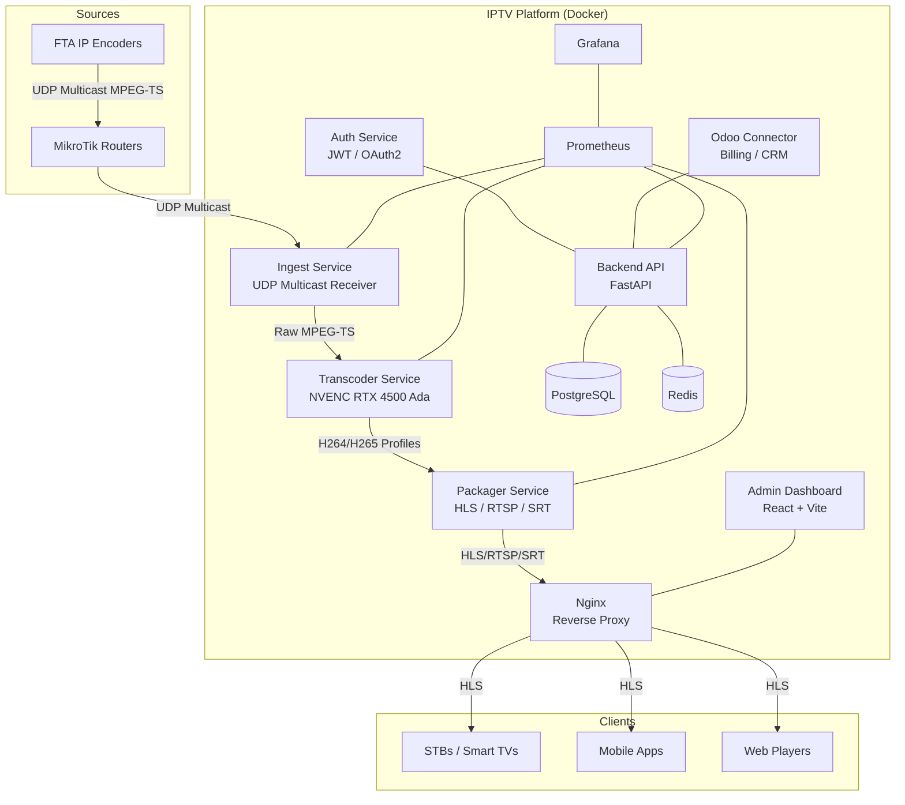

# IPTV Platform – Professional ISP-Grade OTT/IPTV System

[](https://github.com/your-org/iptv-platform/actions/workflows/ci.yml)
[](LICENSE)
[](docker-compose.yml)
[](docs/deployment.md)

Production-ready, fully containerized IPTV/OTT platform for ISPs. Ingests multicast UDP MPEG-TS from MikroTik routers, transcodes via NVIDIA RTX 4500 Ada GPU (NVENC/CUDA), and delivers multi-profile HLS/RTSP/SRT streams with ISP billing integration through Odoo.

---

## Architecture Overview



---

## Services

| Service | Port | Technology | Purpose |
|---------|------|-----------|---------|
| `backend` | 8000 | FastAPI + Python | Main REST API |
| `auth` | 8004 | FastAPI + Python | JWT/OAuth2 |
| `ingest` | 8001 | Python asyncio | UDP Multicast receiver |
| `transcoder` | 8002 | Python + FFmpeg | NVENC GPU transcoding |
| `packager` | 8003 | Python + FFmpeg | HLS/RTSP/SRT output |
| `odoo_connector` | 8005 | Python | Odoo billing integration |
| `frontend` | 3000 | React + Vite | Admin dashboard |
| `nginx` | 80/443 | Nginx | Reverse proxy + HLS |
| `postgres` | 5432 | PostgreSQL 16 | Persistent storage |
| `redis` | 6379 | Redis 7 | Cache + pub/sub |
| `prometheus` | 9090 | Prometheus | Metrics collection |
| `grafana` | 3001 | Grafana | Dashboards |

---

## Requirements

### Hardware
- **GPU**: NVIDIA RTX 4500 Ada (or any NVENC-capable GPU)
- **CPU**: 8+ cores recommended
- **RAM**: 32 GB minimum
- **Storage**: NVMe SSD for HLS segments
- **Network**: Multicast-capable NIC(s)

### Software
- Ubuntu Server 24.04 LTS
- Docker 24+ with Docker Compose v2
- NVIDIA Driver 545+
- NVIDIA Container Toolkit (nvidia-ctk)
- CUDA 12.3+

---

## Quick Start

### 1. Install NVIDIA Container Toolkit
```bash
bash scripts/setup-nvidia.sh
```

### 2. Configure multicast networking
```bash
# Set up multicast on your NIC
bash scripts/setup-multicast.sh eth0
```

### 3. Clone and configure
```bash
git clone https://github.com/your-org/iptv-platform.git
cd iptv-platform
cp .env.example .env
nano .env   # Fill in your values
```

### 4. Initialize the database
```bash
docker compose up -d postgres redis
docker compose run --rm backend alembic upgrade head
```

### 5. Start the platform
```bash
docker compose up -d
```

### 6. Verify GPU access
```bash
docker compose exec transcoder nvidia-smi
```

### 7. Access the dashboard
Open `http://your-server-ip` in your browser.

---

## Multicast Channel Configuration

Add a channel via the API:
```bash
curl -X POST http://localhost/api/v1/channels \
  -H "Authorization: Bearer $TOKEN" \
  -H "Content-Type: application/json" \
  -d '{
    "name": "Canal HD 1",
    "multicast_address": "239.0.0.1",
    "multicast_port": 1234,
    "interface": "eth0",
    "category_id": 1,
    "transcoding_profiles": ["1080p", "720p", "480p"]
  }'
```

---

## FFmpeg Transcoding Profiles

| Profile | Resolution | Video Codec | Bitrate | Audio |
|---------|-----------|-------------|---------|-------|
| `1080p` | 1920×1080 | H264 NVENC | 4 Mbps | AAC 192k |
| `720p` | 1280×720 | H264 NVENC | 2.5 Mbps | AAC 128k |
| `480p` | 854×480 | H264 NVENC | 1.2 Mbps | AAC 96k |
| `1080p_h265` | 1920×1080 | HEVC NVENC | 2.5 Mbps | AAC 192k |
| `720p_h265` | 1280×720 | HEVC NVENC | 1.5 Mbps | AAC 128k |

---

## API Documentation

Once running, OpenAPI docs are at: `http://localhost/api/docs`

Key endpoints:
```
GET  /api/v1/channels              List all channels
POST /api/v1/channels              Create channel
GET  /api/v1/channels/{id}/status  Channel status + bitrate
GET  /api/v1/streams               Active stream sessions
GET  /api/v1/gpu/status            GPU metrics (NVENC usage, temp)
GET  /api/v1/clients               ISP client list
POST /api/v1/auth/token            Get JWT token
GET  /api/v1/m3u                   Dynamic M3U playlist
GET  /api/v1/epg                   XMLTV EPG data
```

---

## Monitoring

- **Grafana**: `http://localhost:3001` — IPTV platform dashboards (channels, GPU, clients)
- **Prometheus**: `http://localhost:9090` — Raw metrics

Metrics exposed:
- `iptv_active_channels_total`
- `iptv_stream_bitrate_mbps`
- `iptv_gpu_nvenc_usage_percent`
- `iptv_gpu_temperature_celsius`
- `iptv_active_sessions_total`
- `iptv_packet_loss_percent`

---

## Deployment

See [docs/deployment.md](docs/deployment.md) for:
- Production Docker Compose configuration
- SSL/TLS setup with Let's Encrypt
- Multi-GPU configuration
- High availability setup
- Backup procedures

---

## Directory Structure

```
iptv-platform/
├── .github/workflows/          GitHub Actions CI/CD
├── backend/                    FastAPI main API
│   ├── app/
│   │   ├── api/v1/            REST endpoints
│   │   ├── core/              Config, security, database
│   │   ├── models/            SQLAlchemy models
│   │   └── services/          Business logic
│   └── alembic/               Database migrations
├── services/
│   ├── ingest/                Multicast UDP receiver
│   ├── transcoder/            NVENC GPU transcoder
│   ├── packager/              HLS/RTSP/SRT packager
│   ├── auth/                  JWT/OAuth2 service
│   └── odoo_connector/        Odoo billing integration
├── frontend/                  React + Vite dashboard
├── nginx/                     Reverse proxy configuration
├── monitoring/
│   ├── prometheus/            Scrape configs
│   └── grafana/               Dashboards + provisioning
├── database/                  SQL schema + migrations
├── scripts/                   Deployment & utility scripts
├── docs/                      Architecture & API docs
├── docker-compose.yml         Development compose
└── .env.example               Environment template
```

---

## License

MIT – see [LICENSE](LICENSE)
