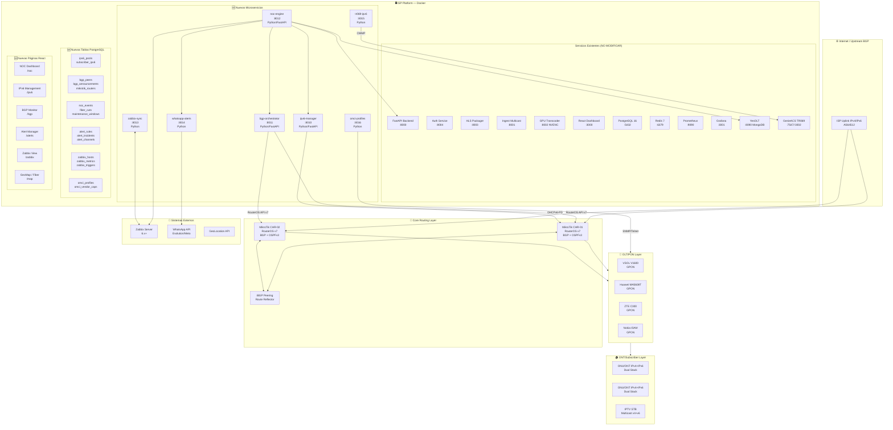

# Arquitectura Carrier-Grade ISP/FTTH — v2.0

## Diagrama General

## Principios Carrier-Grade

| Principio | Implementación |
|-----------|---------------|
| **No-touch existente** | Feature flags por env var, extensión aditiva |
| **Alta disponibilidad** | Healthchecks, restart policies, volúmenes persistentes |
| **Observabilidad** | Prometheus metrics en cada servicio nuevo |
| **Rollback** | Rama git `ipv6-noc-bgp-feature`, migraciones reversibles |
| **Seguridad** | JWT por servicio, mTLS futuro, rate limiting |
| **Escalabilidad** | Stateless services, Redis pub/sub, PostgreSQL partitioning |

## Puertos Asignados (sin conflictos)

| Puerto | Servicio | Estado |
|--------|---------|--------|
| 8000 | Backend FastAPI | Existente |
| 8001 | Ingest | Existente |
| 8002 | Transcoder | Existente |
| 8003 | Packager | Existente |
| 8004 | Auth | Existente |
| 8005 | Odoo Connector | Existente |
| 8090 | YesOLT | Existente |
| **8010** | **IPv6 Manager** | **NUEVO** |
| **8011** | **BGP Orchestrator** | **NUEVO** |
| **8012** | **NOC Engine** | **NUEVO** |
| **8013** | **Zabbix Sync** | **NUEVO** |
| **8014** | **WhatsApp Alerts** | **NUEVO** |
| **8015** | **TR069 IPv6** | **NUEVO** |
| **8016** | **OMCI Manager** | **NUEVO** |
