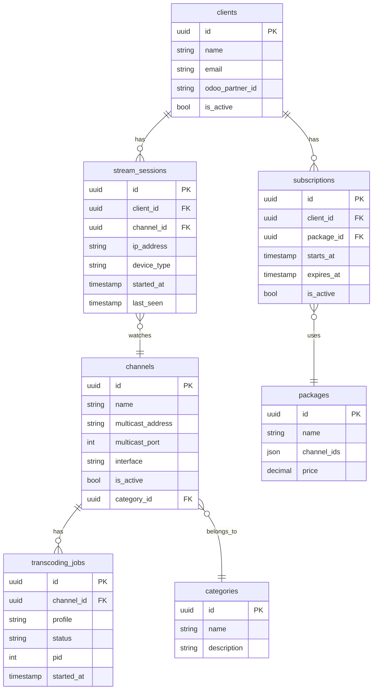

# Architecture Documentation

## Signal Flow

```
FTA Encoder → IP Multicast → MikroTik Router → UDP Multicast LAN
                                                      ↓
                                              Ingest Service
                                            (Socket + PCR monitor)
                                                      ↓
                                           Redis PubSub (raw MPEG-TS)
                                                      ↓
                                          Transcoder Service (FFmpeg NVENC)
                                        ┌──── 1080p H264 ────┐
                                        ├──── 720p  H264 ────┤
                                        └──── 480p  H264 ────┘
                                                      ↓
                                          Packager Service
                                        ┌── HLS segments (.m3u8/.ts) ──┐
                                        ├── RTSP (port 8554)           │
                                        └── SRT  (port 9000)           │
                                                      ↓                │
                                              Nginx Proxy             HLS
                                           (SSL termination)     /var/www/hls
                                                      ↓
                                            End Users (STB/App/Web)
```

## Microservices Communication

- **Synchronous**: HTTP/REST between services (FastAPI)
- **Asynchronous**: Redis Pub/Sub for stream control events
- **Stream data**: Named pipes or shared volume for MPEG-TS data
- **Metrics**: Prometheus scrape (pull model)

## Database Schema



## NVIDIA GPU Pipeline

```
Input UDP MPEG-TS
      ↓
FFmpeg -hwaccel cuda -hwaccel_output_format cuda
      ↓
cuvid decoder (zero-copy to GPU memory)
      ↓
scale_cuda filter (1920x1080 / 1280x720 / 854x480)
      ↓
h264_nvenc / hevc_nvenc encoder
  - preset: p4 (balanced latency/quality)
  - tune: ll (low latency)
  - rc: cbr (constant bitrate for IPTV)
  - zerolatency: 1
      ↓
Output HLS segments or UDP TS
```

## Networking

| Network | Subnet | Purpose |
|---------|--------|---------|
| `iptv_internal` | 172.28.0.0/16 | Service-to-service communication |
| `iptv_monitoring` | bridge | Prometheus/Grafana |
| `host` | host | Ingest service (multicast requires host network) |

## Security Model

- All external traffic via Nginx (SSL termination)
- Services communicate over internal Docker network only
- JWT tokens for API authentication (short-lived, 60 min)
- Refresh tokens stored in Redis with TTL
- Odoo connector uses API key authentication
- Rate limiting at Nginx level
- Audit log for all client/subscription changes
